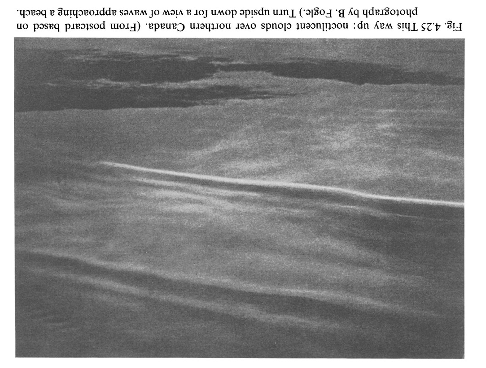

 
 
 
 
 
 
 
 
 
 
 
 
 
 
 
 
 
 
 
 

## 4.3.2 観測

電離層応答の偏りがあるにもかかわらず、上層大気の音響重力波に関する利用可能な情報のほとんどは電離層観測から得られており、この場合、通過する重力波によって引き起こされる摂動は、*走行電離層擾乱* と呼ばれている。この点については、7.5.5節で解説する。直接的な証拠は、より限定的であるが、説得力がある。重力波は、80〜90kmの高さにある夜光雲の写真に、海面の波のような構造として写っている（図4.25）。また、流星痕やロケットから放出された蒸気痕の歪みにも見られる（4.2.2項）。また、衛星搭載の質量分析計や加速度計によって、*その場で* (`in situ`) 検出されることもある。
上空で検出される音響重力波は、そのほとんどが下層で発生したものである。例外は、数秒から1分程度の周期を持つ低周波で、地上の圧力センサー（マイクロバロメーター）で検出することができる。興味深いのは、オーロラ活動に関連し、オーロラ帯から飛来すると思われる低周波のイベントである。これらのイベントは、110km付近の高さにあるオーロラエレクトロジェット（8.4.2節）の加熱と電気力学的な力に起因すると考えられている。

---

> 
> Fig 4.25
> こちらが上。カナダ北部の夜光雲。(B.フォーグルの写真に基づくポストカードより）。浜辺に打ち寄せる波の視点にするには、上下逆さまにせよ。

 

## 4.4 標準的な大気とモデル

気圧、温度、密度、組成などの主要な量に関する最新の情報を便利な形で提供するために、大気の既知のパラメータが随時照合される。データは、緯度、季節、時間帯、太陽黒点数などの主要な外的要因に応じた表として表示されることがある。このような編集物は、一般に*標準大気* と呼ばれる。また、必要な値をデータベースから呼び出したり、場合によっては第一原理から計算するコンピュータプログラムの形をとることもある。この場合、*モデル* という用語が一般的に使われる。
最近（1980年代半ば）、モデリング手法が注目されるようになったのには、2つの理由がある。第一に、太陽地球環境の多くの側面について十分な情報が得られるようになったため、科学的に価値があること。第二に、それを実現し、誰もが利用できるようにするためのコンピュータが登場したことである。モデリングは、科学の進歩における自然な展開であり、あるテーマについて利用可能な知識と理解をまとめ、その情報を自由に呼び出して予測に利用できるようにする試みである。
「標準大気」には、1962年に発行され、1966年と1976年に改訂された米国標準大気や、1961年、1965年、1972年のバージョンがあるCOSPAR国際基準大気（CIRA）などがある。

---

基本的にモデルには2種類ある。*経験的なモデル* (`empirical model`) は、蓄積された事実と数字で構成されている。基本的にはデータの収集だが、独立変数への依存関係が表現されている。場合によっては、これらの依存関係を数式で表現することもできるが、それでもモデルの経験的な性質は変わらない。経験的なモデルには物理学的な要素はなく、その成功は、表現された量がどれだけ再現可能であるかに依存する。例えば、季節や時間帯などの同じ条件下で、ある高さの大気温度が常に同じであるかどうか。当然ながら、「ノイズ」の要素も常に存在し、そのノイズが実際の変動と比較して小さい限り、モデルは有用であると言える。
一方、*数理モデル* は、状況の基本的な物理を表す一連の方程式で構成され、これらを（通常は数値的手法で）解くことで目的の量を得ることができる。中性空気中の風の計算は、数学的モデリングの一例であり、この方法は電離層の研究でも重要である。数学的モデリングの利点は、与えられた入力に対して数学的に正しい結果が得られることである。また、観測されていない条件（例えば、ごくまれにしか発生しない黒点数が非常に多いなど）についても計算することができる。数学的アプローチには、関連するプロセスが不明であったり、入力パラメータが不確かであったりするため、いくつかの危険性がある。数学的な精度は物理的な精度を保証するものではなく、現実世界に対する検証が重要である。
純粋に経験的なモデル、純粋に数学的なモデルの他に、経験的な部分と数学的な部分の両方が混在しているものもある。このようなモデルでは、ある量は計算され、他の量はデータベースから取得される。また、計算された値は、データセットの観測上のギャップを埋めるために使用される。
上層大気のモデリングや計算の多くは、多かれ少なかれ中立大気が関与していると考えられるので、中立大気のモデル（表形式の標準大気を含む）は基本的に重要である。前述の標準大気は、温度、密度、圧力、スケール高、組成、風などを示す表の本として出版されている。その一部は、NASAゴダード宇宙飛行センターで開発されたMSIS（質量分析計-非干渉性散乱）モデルというコンピュータプログラムとして公開されている。これは高度50kmから2500kmまでの中性大気を扱い、ロケット、衛星、インコヒーレントスキャッターレーダーからのデータに基づいている。MSISはコンピュータのディスケットで提供されており、時間帯、季節、緯度などの条件を指定すると、さまざまな中性種の数密度、全質量密度、温度が得られる。

 

## さらなる参考文献

割愛

---

5  
ー 
太陽風と磁気圏  

 

Magnus magnes ipse est globus terrestris.  
(地球はそれ自体が大きな磁石である。)  
W . Gilbert, De Magnete (1600)  

 

## 5.1 イントロダクション

磁気圏は、地球環境において地磁気の影響を強く受ける領域である。一般に（例外もあるが）、磁場のエネルギー密度はプラズマのそれを上回る：

$$
\mathrm{B}^2 / 2 \mu_0>\mathrm{nkT}
$$

(SI 単位) ここで、Bは磁束密度、kはボルツマン定数、プラズマは温度Tで1立方メートルあたりn個の粒子を含んでいる。粒子と磁場のエネルギー密度の比は、通常βと書かれ、重要なパラメータである。磁気圏は、低高度側では電離層に気づかないほど融合している（第6章、第7章）。磁気圏と電離層の伝統的な区分は、物理学的というよりも意味論に基づくものである。磁気圏の外側の境界は、太陽風との相互作用によって決定されます。磁気圏は、地球の最も外側の部分と見なすことができる。
磁気圏に関する現在の知識は、四半世紀以上にわたる宇宙探査の結果である。地上から学べることは限られており（地上での重要な技術もあるが）、磁気圏物理学は現代科学としか言いようがない。電離層科学が古いのは、多くの観測が地上からできるためです。
地磁気が存在する以上、磁気圏の形態や構造は太陽からの放射によって大きく左右され、磁気圏は様々な太陽放射の変化に対して迅速かつ容易に反応する。太陽活動は絶えず変化しているので、磁気圏も日ごとに、また時間ごとに変化する。そこで、まず太陽から話を始めることにする。

 

## 5.2 太陽放射

太陽は典型的な恒星で、広いスペクトル範囲の電磁波、連続したプラズマ、高エネルギー粒子のバーストを放射している。目に見える表面である光球は、6400Kの黒体で近似できる。

---

 
 
 
 
 
 
 
 
 

> Fig 5.1
> コロナが見られる日食 (`solar eclipse`) (G. Newkirk, High Altitude Observatory, Boulder, Colorado)

 
 
 
 
 
 
 
 
 
 

その半径は約70万kmで、その上には光に対して透明な領域である彩層とコロナがある。彩層は光球の上空約2000kmにあり、その温度は5万Kに達するため、日食の際に見ることができる。コロナは約 $1.5 \times 10^6$ Kで、$10^6$ km以上にわたって観察できるが、実際には明確な終端はない。地球軌道上では、コロナ温度は約 $3 \times 10^5$ Kである。図5.1は、日食時に撮影されたコロナの写真である。
太陽の活動領域が一様に分布していないため、太陽の自転は地球物理現象との関連で重要である。自転周期は緯度とともに長くなり、赤道では25.4日、緯度75度では33日である。そのため、地球で受ける放射の強さは太陽の自転周期によって変化し、地球物理学的な目的のための典型的な平均周期は27日である。

 

## 5.2.1 太陽電磁放射

太陽は $4 \times 10^{26}$ Wの電磁波を放出し、地球にはほぼ $1.4 \ \text{kW/m}^2$ 照射し、その約半分が地表に到達している。黒体温に対応して、スペクトルは可視光線をピークに、短波長側（紫外線、X線、Y線）、長波長側（赤外線、電波）ともに強度が低下している。

---

 
 
 
 
 
 
 

> Fig 5.2
> 太陽面観測衛星「アクティブキャビティ放射計」の放射照度モニターで検出された太陽放射エネルギーのフラックス (R. C. Willson, private communication)

 
 
 
 
 
 
 
 

我々は太陽放射の変動に関心を持つが、実は太陽フレアと呼ばれる局所的な明るさを除けば、可視域では1%以内と極めて一定である（図5.2参照）。電離層で特に注目されるのは、紫外線とX線からなる短波長側である。これらの放射は、彩層とコロナから発生する。地表には届かないが、ロケットや人工衛星を使って高高度から観測されることが多い。放射線の連続体に加え、いくつかの強い離散的な線がある。この部分は、可視光線よりも変化しやすく、特に短波長側で顕著である。図5.3は、3.2μmまでの太陽スペクトルの領域を示している。我々が最も関心を持つのは、100nm（1000Å、0.1μm）以下の領域で、ピークの短波側に大きく離れている。

 

## 5.2.2 太陽フレア現象

太陽フレアとは、光球の小さな領域が突然明るくなる現象で、数分から数時間続くことがある。フレアは、太陽をHa光（656.2nm）で見たときに明るくなる範囲によって1〜4段階に分類される。また、非常に小さな輝きは、*サブフレア* のSと呼ばれる。フレアは、黒点と呼ばれる長く続く暗い部分や、*プラージュ* と呼ばれるカルシウムK ($\text{Ca}^{2+} $イオン) や $\text{H}\alpha$ の発光が強まる領域の近くで発生する傾向がある。
太陽フレアは、地球上層大気に影響を与える散発的な粒子や電磁波の放出源であるため、太陽と地球の関係において重要であるが、そのメカニズムにはまだ多くの不明点がある。観測によると、フレアには高温のプラズマと低温のプラズマの両方が含まれている。光学的に見えるフレアは約$10^4$ Kと比較的低温で、主な部分は5000km以下の低コロナにあるが、低コロナに大きく上方へ広がっていることがある。

---

 
 
 
 
 
 
 

> Fig 5.3
> 地表に到達する太陽電磁波のスペクトル（主要な吸収種の影響を含む）、および大気圏外でのスペクトル。比較のため、6000Kの黒体曲線を示している。電離層の主な影響は0.1μm（100nm）以下である。(After J. C. Brandt and P. W. Hodge, Solar System Astrophysics. McGraw- Hill, 1964)

 
 
 
 
 
 
 
 

目に見える明るさは、プラズマ密度が$10^4$から$10^7$ 個$/ \text{m}^3$ (電子の個数) に増加したためで、見える領域は可視太陽系の1000分の1を占めるが、厚さは20kmに過ぎないことがある。プラズマが大きく圧縮されたことは明らかで、圧縮されるまでは$10^{14} \text{km}^3$の体積を占めていたようだ。同時に発生した高エネルギープラズマの温度は $10^7 〜 10^8$ K、電子密度は $10^2 \text{m}^{-3}$ 程度である。
典型的なフレアは$10^{25}$ J（$10^{32}$ erg）の電磁エネルギーを放出し、おそらくさらに $3 \times 10^{25}$ Jを粒子として放出する。この膨大なエネルギーが磁場に蓄積され、磁場が消滅するときに放出されることは、かなり確かなことである。この考え方が妥当であることは、磁場の大きさと体積から容易に理解できる。黒点付近の磁場が数百ガウス、圧縮前の体積が $10^{14} \text{km}^3$ であることを考えると、単純計算で磁気エネルギーの総量は必要な $4 \times 10^{25}$ Jをゆうに超えることがわかる。
ある領域にエネルギーが蓄積されるのに約1日かかるが、エネルギーが放出されるときは、わずか数百秒である。何らかの「トリガー」となるプロセスが関与して、磁場が消滅を起こすような配置になったのだろう。 
その配置の正確な形は定かではないが、一つの可能性を図5.4に示す。図には、太陽と地球の関係で注目される様々な放射線の発生源の可能性が記されている。
このモデルでは、磁気エネルギーの変換は、逆極性の2つの黒点の上にある中性点から始まる。磁場が崩壊すると、粒子はエネルギーを得て、磁力線に沿って中性点から離れる方向に移動する。一部のプロトンは外部に移動し、最終的には地球で太陽プロトンイベント（8.5項）を引き起こす可能性がある。

---

 
 
 
 
 

> Fig 5.4
> 太陽フレアのモデルで、既知の生成物について考えられる発生源 (After J. H. Piddington, Cosmic Electrodynamics. Wiley, 1969)

 
 
 
 
 
 
 

内向きの電子の一部は、より密度の高い彩層で停止し、そこで制動放射X線（6.2.3節と8.3.7節）を発生し、これが地球に到達すると、下部電離層に急激な乱れを生じさせる（7.1.5節）。彩層の同じ領域では、水素が電子の衝突によって電離し、再結合する際に$\mathrm{H} \alpha$線を放出するため、地球からは$\mathrm{H} \alpha$*フレア*として観測される。フレアの領域では、コロナが加熱され、軟X線と紫外線を放出する（いずれも地球への影響がある）。フレアの上空に放出されたプラズマは*太陽風* を強める（5.3節）。太陽電波バースト（5.2.3節）の多くも、このようなモデルで説明できる。
図 5.4 の詳細は不確かなため、文字通りに受け取るのではなく、どのようなメカニズムが関与している可能性が高いかを示すものである。しかし、太陽フレアの構造と地球磁気圏のサブストーム（5.9節）の構造の間に著しい類似性があることは興味深いことである。

 

## 5.2.3 太陽からの電波放射

### *熱放射*

太陽は、太陽活動のさまざまな側面を反映する、いくつかの種類の電波放射の源である。熱放射は常に存在し、放射領域の温度に対応している。
電離した媒体は、プラズマの周波数（2.3.4節）を超える周波数の波に対してのみ透明であるため、放射が太陽から離れるレベルは電子密度に依存する。実際、ある周波数の放射線のほとんどは、その周波数がプラズマ周波数となるレベル付近で発生する。10cm波は上部彩層から、メートル波はコロナからやってくる。
対応する温度はそれぞれ75,000Kと $10^6$ Kであり、これらによって放射強度が決定される。

---

### *散発的な放射*

さらに、タイプIからIVと呼ばれる4種類の散発的な放出が発生する。
タイプIのノイズストームは数時間から数日間続き、強烈で鋭いスパイクで構成されている。太陽黒点付近の小さな領域から発生し、フレアが発生したときに始まることが多い。波長数メートルで観測され、太陽黒点上空の磁場中の電子流によって発生すると考えられている。
太陽放射のうち、最も激しいものは太陽フレアに関連し、II型またはIII型と呼ばれる。後者は、フレアの開始時に多数の鋭いバーストが発生し、高周波の変化や走査型干渉計で観測されるように、擾乱が急速に外部に移動する。マイクロ波と硬X線（10-100keV）のインパルスバーストが同時に発生することが多い。タイプIIバーストは5〜30分続き、大きなフレアが発生したときに観測されることがある。これも波長はメートルだが、タイプIIIより遅く、おそらくフレアから飛び出した衝撃波によるものだろう。速度は1,000km/sで、高速の太陽風の流れの典型である（5.3.5項）。
Type IVは、いくつかの大きなフレアに続いて発生する長時間のバーストで、広い周波数帯域をカバーする。太陽磁場中の高エネルギー粒子からのシンクロトロン放射に起因すると考えられている。タイプIVの様々なサブクラスは、陽子放出や太陽磁場の拡大ループに関連している。