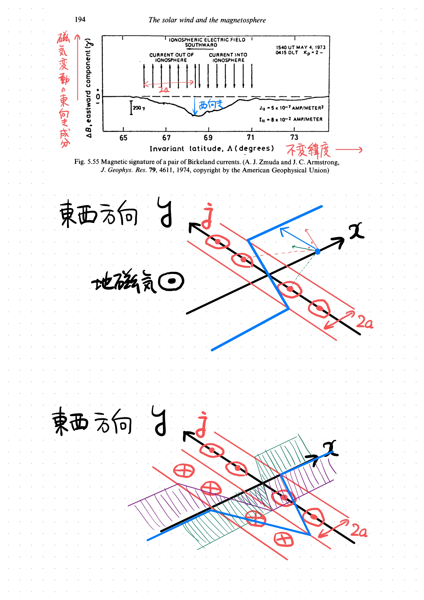

 
 
 
 
 
 
 
 
 
 
 
 
 
 
 
 
 
 
 
 
 
 
 
 
 
 

## 5.8.3 環状電流

この環状電流は、低緯度の地上磁力計で検出されることがある。磁気嵐（7.4.2節で詳述）の発生時には、地表の磁場が数時間から数日にわたって低下することが古くから知られている。磁気嵐の開始時には磁場が上昇することがあり、これはChapmanとFerraro（5.3.1節）が最初に提案したように、増加した太陽風の到来による磁気圏の圧縮によって説明される。それに続く磁場の低下は、図5.51bのように、磁気圏の環状電流が地球を東から西に（北極上空から見て時計回りに）流れているためである。地表で30nTの落ち込みがあり、これは中程度の磁気嵐であるが、(`この地表磁場の低下は`) 地球の中心からの距離 $4.5 R_E$ (`の上空`) に $10^6 \text{A}$ (`の環状電流が流れていると置くこと`) で説明することができる。電流と磁場の間の単純な関係は

$$\Delta B \text{ [nT]} = 2 \pi I \text{ [A]} / 10 r \text{ [km]}$$

であり、これは円電流の中心に作られる磁束密度の標準的な公式 ($B = \mu_0 I/2r$) に基づいている。

---

 
 
 
 
 
 
 
 
 

> Fig 5.53
> 磁気嵐時の `地球半径の` $L = 4$ `倍` の環状電流におけるプロトンのエネルギースペクトルと数密度スペクトル。

 
 
 
 
 
 
 
 
 

地中に誘導される電流は、地中の導電率に依存する量だけ効果を増大させ、通常、約3/2のファクターに相当する。したがって、近似的な関係は次のように

$$\Delta B \approx 3 \pi I / 10 r \approx I / r \tag{5.46}$$

距離rは、もちろん地上からの観測だけでは決定できないが、衛星による測定では決定可能である。例えば、衛星搭載の磁力計が環状電流の内側にあれば、地上で見たのと同じ意味の効果が観測され、衛星が環流の外側にあれば、逆の意味の効果が観測される。
陽子は西に、電子は東に流れるため、捕捉された粒子の漂流によって (`北極から見おろして`) 時計回りの環状電流が発生する（5.7.2項）。1958年にヴァン・アレン粒子が発見された後、これが環状電流の原因ではないかと考えられたが、よくよく考えてみると、当時観測されたヴァン・アレン帯には十分な量の粒子が含まれていないことがわかった。この粒子はエネルギーが低く、主に10～100keVの陽子である（図5.53）。一般に、電流はプラズマシートの内縁と捕獲帯の外縁に近い、$4～6R_E$に位置する。その領域に粒子が集中するのは、磁気圏対流の結果である（5.5節）。リコネクション地点の地球側のテール場(`tail field`)の内向きの対流によって粒子は内側に加速されるが、最終的には地球に近い強い場でミラーリングされ、ここでプラズマシートの内縁が形成される。
式5.40によれば、捕捉された粒子の縦方向のドリフト率は、そのエネルギーに比例する。

---

 
 
 
 
 
 
 
 
 

> Fig 5.54
> 1984年9月5日、AMPTEを通過する際の様々な重イオンの放射状プロファイル。(a) 数密度、 (b) 単位電荷あたりのエネルギーが 5 〜 315 keV の粒子のエネルギー密度。

 
 
 
 
 
 
 
 
 

各陽子は同じ電荷（＋e）を持っているので、総電流は、すべてのエネルギーで積分した粒子密度と粒子エネルギーの積に比例する。したがって、総電流は環状電流を構成する粒子の総エネルギー　─ 実質的に陽子の総エネルギー(E)に比例する。したがって、式5.46を用いると

$$\Delta B \approx 2.6 \times 10 ^ {14} E \text{ (J)} \tag{5.47}$$

すなわち、環状電流によって磁場が減少することが理解される。
環状電流の主要なイオンは $\text{H}^+$ であるが、$\text{O}^+$、$\text{He}^+$、$\text{He}^{++}$、$\text{O}^{++}$といったより重いイオンも存在する（図5.54）。
環状電流のエネルギー密度は、地磁気のエネルギー密度（$5R_E$の地点で$2×10^{-8} \text{ J/m}^3$）を超えることがあり、その後、地磁気が歪むようになる。これは地磁気のインフレーションと呼ばれ、β ＞ 1（5.6.1節）の条件の一例である。安定した環状電流が存在するには、粒子にかかる遠心力、歪んだ磁力線に沿った磁気張力、粒子圧の勾配がバランスしている必要がある。

---
 
 
 
 
 
 

> Fig 5.55
> 一対の Birkeland 電流の磁気シグネチャー

 
 
 
 
 
 
 
 
 

中緯度安定赤色（SAR）アーク（6.4節で説明）の形成は、環状電流が地球に接近してプラズマポーズに遭遇すると、環状電流の中で不安定性が生じることに起因するとされている。この不安定性は電離層にエネルギーを送り込み、そこでガスが数千度加熱され、630nmの大気光放射が発生する。

### 5.8.4 Birkeland 電流 `(沿磁力線電流)`

電離層電流は水平方向にしか流れないと長年考えられており、垂直方向の電流の可能性が排除されていたため、地上のマグノグラムから得られる電流系は、実際には同等の電流系 (`? the equivalent current system`) でしかなかった。実際、福島の定理（8.4.2節）では、地上から垂直方向の電流は検出できないことになっている。しかし、6.5.5節で述べるように、地磁気に沿った導電率は磁場を横切る導電率をはるかに上回っており、磁場に沿って何らかの電流が流れるという考えを軽々に否定することはできない。磁場に沿って電流が流れるという考えは、1908年にK.Birkelandによって初めて提唱されたが、証拠がないため、この考えは何年も休眠状態にあった。1960年代に理論的な根拠から再び注目されるようになったが、確かな根拠が見つかるまでにはさらに数年の歳月が必要であった。
1970年代前半の人工衛星（ISIS-2 と TRIAD）による磁気観測は、説得力のあるものだった。衛星がオーロラ帯を通過したとき、図5.55のような西向きの磁場が緯度2〜3度（200〜300km）にわたって広がっていることを示す磁気信号を記録した。これは、高緯度側では下向きに、低緯度側では上向きに流れる $5×10^{-7} \text{ A/m} ^2$ 程度の電流の二重板を衛星が通過したと考える必要がある。その後、他の衛星観測によって、電流の統計的な分布がプロットされ、多くの詳細が明らかにされた。
この電流は図5.56のような典型的な分布で、ほぼ常に存在し、擾乱レベルの上昇とともに強まり赤道方向 (`equatoward`) に移動し、明らかにオーロラオーバル（8.3.2項）と関係している。電離層に流入・流出する成分は、夕方から朝にかけて（ほぼ）入れ替わる。

---

---

 
 
 
 
 
 
 
 
 

> Fig 5.56
> Birkeland流の分布 (a) 弱い擾乱時、 (b) 活発な擾乱時

 
 
 
 
 
 
 
 
 

> Fig 5.57
> Region 1 と Region 2 における活動期（上段）と弱乱期（下段）のBirkeland 電流の大きさ。
> (`北極上空から覗き込んでいると考えればわかりやすい`)

---

 
 
 
 
 
 
 

> Fig 5.58
> Kp指数で測定される磁気活動に伴うBirkeland電流の変化

 
 
 
 
 
 
 

慣習的に、電流の流れの方向に関係なく、極側にある領域を「領域1 (`Region 1`)」、赤道側にある領域を「領域2 (`Region 2`)」と呼んでいる。各領域の電流密度は時間帯によって異なり（図5.57）、地球の昼側では領域1が支配的で、深夜には両領域がほぼ同じ強さになる。真夜中には、下向きの2つの領域の間に上向きの1つの領域という3つの領域で流れが発生する遷移があり、これは*ハラン不連続面* として知られるエレクトロジェット (`電離層の高層電流`) の反転に関係している（8.4.1節）。電流密度は磁気活動指数 $K_p$ に対してほぼ直線的に変化する（図5.58）。Birkeland 電流システムの総電流は $10^6～10^7 \text{A}$ で、様々な領域やセクターの電流を収支すると、測定精度の範囲内で、電離層に流入する総電流と流出する電流が等しくなることがわかる。

# 5.9 磁気圏のサブストーム (`磁気嵐`)

## 5.9.1 断続的な合流がもたらすもの

磁気圏の循環は(主に)磁気圏界面の太陽側での磁気合流によって駆動されるが、その連続性はテール側のプラズマシートでのリコネクションに依存する。図5.59はある選択された磁力線の略歴である。IMF (`Interplanetary Magnetic Field, 惑星間空間磁場、ここでは太陽風中の磁場`) と接続し, 開放線として極域を対流したのち、尾部で再接続して、地球方向への回帰流でほぼ双極子の形に戻る。$R_M$ と $R_T$ がそれぞれ磁気圏界面と尾部での接続速度であり、$T$ が尾部への開磁力線の輸送速度であり、$r$ が尾部から閉磁圏へ閉磁力線が戻される速度である場合、

$$
\mathrm{R} _{\mathrm{M}} = \mathrm{T}=\mathrm{R} _{\mathrm{T}} = \mathrm{r}
$$

この式は定常循環状態を意味する。

---

 
 
 
 
 
 
 
 
 

> Fig. 5.59
> ある選択された磁力線の略歴

 
 
 
 
 
 
 
 
 

> Fig. 5.60
> サブストームの成長期における磁気圏の変化
> EROSION: 浸食, 
> EQUATORWARD MOTION: 赤道方向の変動, 
> INWARD MOTION: 内側方向の変動, 
> REDUCTION: 縮小, 
> ENLARGEMENT: 拡大, 
> THINNING: 薄化

---

 
 
 
 
 
 
 

> Fig. 5.61
> サブストーム中での第二の中性線の形成

 
 
 
 
 
 
 
 
 

十分に長い時間にわたって、次の式が成り立たなければならない。

$$
\overline{\mathrm{R}} _{\mathrm{M}}=\overline{\mathrm{T}}=\overline{\mathrm{R}} _{\mathrm{T}}=\overline{\mathrm{r}} .
$$

一方、断続的な合流は不均衡を引き起こす。(`昼側のリコネクション領域では北向きの地磁気に対して南向きの太陽風磁場がぶつかることでリコネクションが起こっているので`) IMFが南を向くと、接続率が上昇し、しばらくの間、$R_M > R_T$となる。このとき、除去される開磁力線の数よりも生成される開磁力線の数の方が多く、(`極域で磁力線密度が大きくなるので`) これがオーロラオーバルが赤道方向に移動する理由である（セクション5.5.1）。$R_T > R_M$ の場合、尾部のリコネクション率が磁気圏界面でのリコネクション率を上回るため、開磁場の正味の損失が生じ、オーロラオーバルは再び縮小する。
磁気圏界面の接続は、離散的で限定的だが頻繁な「磁束移動現象」の連続として進行することを見てきた。尾部の接続は、頻度は低いが、より激変的な事象で進行し、これがサブストームの基礎となる。サブストームはもともとオーロラの地上研究（8.4.4節）から同定されたもので、3つのフェーズが同定されている：

- 成長期
- 拡大期、そして
- 回復期

---
 
 
 
 
 
 
 
 
 

> Fig. 5.62
> サブストーム発生中における磁気テールでの現象の時系列。白い矢印はプラズマの流れを示す。プラズマシートは磁力線という境界に囲まれている。N'はサブストームで形成される第二の中性線であり、図⑧はテールによって追い出されたプラズモイドを表す。

 
 
 
 
 
 
 
 
 

磁気圏では、成長期は磁気圏前面からの侵食の増大に対応し、図5.60に示すように、この時期にプラズマシートは薄くなる。拡大期は、静穏期よりも地球に近い中性線の形成から始まる（図5.61）。地球同期距離の衛星は高エネルギー電子のフラックスの増加を観測し、地磁気はより双極的になる。図5.62はこのような一連の流れを示している。2本の中性線の間にある尾部の領域は、回復期が始まると磁気圏尾部に沿って放出されることを付言しておく。これは*プラズモイド*として知られている。膨張相でプラズマシートが薄くなることは、中性シート近傍の衛星による粒子束の損失として検出することができる。プラズモイドの放出は、地球から遠ざかる高エネルギー粒子のバーストとして、尾の20〜100RE下の衛星によって検出されるかもしれない。
サブストーム発生時の磁気圏尾部の正確な構成はまだ完全には確立されておらず、いくつかのモデル（観測ではまだ区別できない）が提唱されている。尾磁場の局所的な反転を伴うモデルもあれば、オーロラで見られる複数のアークに対応する複数の中性線を含むモデルもある。
